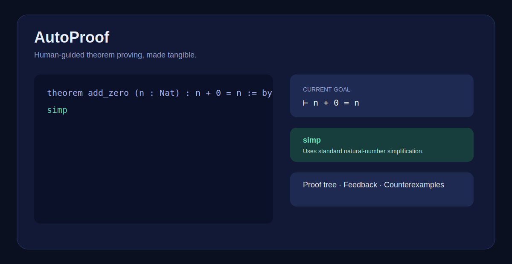

# AutoProof

**An approachable, human-in-the-loop theorem proving workspace.** AutoProof pairs a Lean 4 proof editor with AI tactic suggestions, explainable proof trees, feedback capture, and counterexample hints.



## What is included

- Interactive web playground with a deliberate, keyboard-friendly proof workflow.
- Lean 4-oriented proof session API, with graceful demo mode when Lean is not installed.
- Local-first model adapter for Ollama/OpenAI-compatible endpoints, plus deterministic suggestions so the UI always works.
- Human feedback stored in SQLite and exportable as JSONL for fine-tuning.
- Proof-tree data API, explanation cards, and bounded natural-number counterexample search.
- Docker development setup and a clear path to real Lean/Ollama deployments.

## Quick start

### With Docker

```bash
docker compose up --build
```

Open `http://localhost:3000`. The API documentation is at `http://localhost:8000/docs`.

### Local development

```bash
# terminal 1
cd backend
python -m venv .venv
.venv/Scripts/activate  # Windows
pip install -r requirements.txt
uvicorn app.main:app --reload --port 8000

# terminal 2
cd frontend
npm install
npm run dev
```

Copy `.env.example` to `.env` to use an Ollama or OpenAI-compatible model. Without it, AutoProof runs in useful deterministic demo mode.

## Lean integration

Set `LEAN_COMMAND=lean` when Lean 4 is on your path. AutoProof invokes Lean in an isolated temporary working directory and returns diagnostics. Production deployments should use a container with a pinned Lean toolchain and a dedicated project environment (Mathlib if desired).

## API overview

| Endpoint | Purpose |
| --- | --- |
| `POST /api/sessions` | Create a theorem-proving session |
| `POST /api/suggest` | Get tactic candidates and explanations |
| `POST /api/apply-tactic` | Validate/apply a tactic and extend the proof tree |
| `POST /api/feedback` | Record approval, edits, or rejection rationale |
| `GET /api/sessions/{id}/tree` | Read proof-tree JSON |
| `POST /api/counterexample` | Search bounded natural-number assignments |

## Feedback and fine-tuning

Feedback is stored in `backend/autoproof.db`. Export it with:

```bash
python models/export_feedback.py --database backend/autoproof.db --output data/feedback.jsonl
```

The resulting JSONL is intentionally simple to feed into PEFT/Axolotl/SFT pipelines. Never export private proofs without reviewing the dataset first.

## Architecture

```text
Next.js UI  ──► FastAPI orchestration ──► Lean CLI (when available)
     │                 │
     │                 ├── Ollama / OpenAI-compatible model
     │                 ├── SQLite feedback store
     └── proof tree ◄──┴── bounded counterexample search
```

## Contributing

Issues and small, focused pull requests are welcome. Keep user-provided proof data private by default, add tests for backend behavior, and preserve the accessible interaction model (visible focus, text labels, no color-only state).

